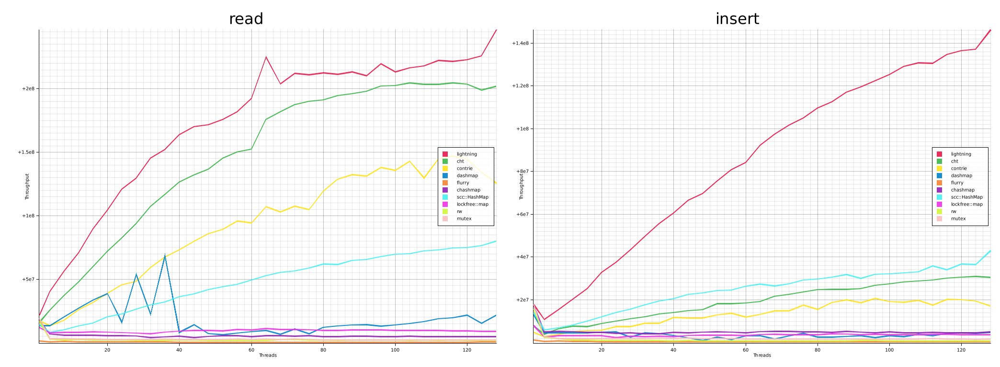

# Lightning containers
Set of lock-free data structures

* Hash map
* Hash set
* Linked hash map
* Buffer linked list 

The intention of this project is to provide variety of commonly seen shared data structures for
performance senstive applications. Almost all of the data structures in the list are lock-free. The hash map is lightning fast and possibly the fastest according to my benchmark.

## Hash Map
The design of the hash map is derived from Cliff Click's talk on Stanford University. It is linear scalable on concurrent workloads even under very high contentions. All operations, including insert, read, update and remove are lock-free, including case of internal buffer resize. The data structure composites of a few atomic variables and one or two large buffer on the heap. The atomic variables are used for statistics purposes and pointers for the buffers contains data. Each key-value entry is a double word pair in the buffer and the data structure act on it by issuing seperate atomic operations. The hash map scans key-value entry by stride 1 atomic load, which implicits ideal cache locality and have the potential to be optimized further by prefetching. 

### Resize
In case of the buffer cannot hold the key-value entries within optimal fill rate, the buffer would resize. The resize process is also lock-free and passively parallelized. If one thread found out that the fill rate goes exceeds optimal, it will create a new buffer with size doubled and start to migrate key-value pairs from the old buffer to the new buffer before insertion. During the migration, new entries will be inserted to new buffer, and read operations starts from old buffer first and then the new buffer. Each of the operations have the need to scan the old buffer, will migrate the validated pairs it scanned to the new buffer. 

### Contentions
The hash map has considerable small performance degradation under high contention workloads. This is because of the cost for each of the contention is low and mostly scattered across the buffer. The shared statistics atomic variables are eventual consistent and the buffer pointers only changes upon resize. Strong ordering atomic operates on key-value entry buffers by key and value basics, which the only contention occurrence is hash collision and key contention, both of them can be resolved with a few atomic operations.

### Mapping Types
To maximizing the throughtput and avoid unnecessary instructions, lightning provide various flavours for different use cases. 
* **HashMap<K, V>** provides generic `K` to `V` mapping.
* **ObjectMap\<T\>** priovides `usize` to generic `K` mapping
* **WordMap** provides `usize` to `usize` mapping

Since atomic operations only works on `usize`, supporting generic key and value types needs considerable extra works that does not need for `WordMap`. Generic hash map has attachment buffer alone with key-value pair buffer, to be used as the container for generic typed key and values. When attachment buffers are available, original key-value buffers pairs are used for hash value and markers. Keys in attachment buffers will be checked against the lookup key in case of `K` to `V` mapping. Both of the `K` and `V` types must implement `Clone` trait, because keys and values will be simply to be cloned into or out of the attachment buffer.

### Entry-wise Mutex and Read-write Locks
Some use cases may require to take lock on an entry in the hash map. Lightning provides this litte additional features by using the under utilizerd spece in its entry buffers. Typically, locking on individual entries in the hash map requires put the lock itself and the value protected by the lock wrapped by `Arc` on the heap. This is wasteful when lightning is able to achieve the same without allocating additional space for the locks itself, but using its internal data structures only. The hash maps provides following types of locks.
*  **HashMap<K, V>** provides read-write lock
*  **ObjectMap\<T\>** provides read-write lock
*  **WordMap** provides mutex

All of the locks provided by lightning are spin-locks. They are designed for low key contentions scenarios. If the use case expects high contentions on specific keys, consider using more complex locks wrapped by `Arc` instead for thread reschduling. 

### Easy of Use and Simplified Memory Management
The memory management approach on lightning hash map is simple, yet efficient. Epoch-based memory reclamation are performed on buffer basics upon resizing. For the key-value pair, because they implement `Clone`, it is up for the pair types itself to ensure no memory leaks. A typical use case for `HashMap<K, V>` type is to use a key with low clone cost and wrap value inside atomic reference counting container `Arc` for safety. 
* No lifetime complications. It does not make sense to hold the reference of a value when it is likely to be changed by other threads, at a reasonable cost.
* There is no need to `pin` for guards before accessing the hash map.
* In case of the needs for exclusive access to the values, use the entry mutex or locks instead.

This hash map is not a drop-in replacement for the `std` Hashmap despite it have similar interfaces for `get`, `insert`, `remove` functions. As for updating a value of an entry, lightning provides `update` funtion, which takes a closure has no side effects to update the value after it was read from the entry.

### Use Cases
* Indexing in database systems
* Object directory in memory allocators
* Simulations

### Performance
Benchmarks are besed on the throughput in terms of thread count. The test platform has following hardware
* OS: Ubuntu 20.04.2
* CPU: AMD Ryzen Threadripper 3990X @ 2.2GHz
* RAM: 256GB @ 3200MTs
* Rust: 1.54.0-nightly
  
Test data are synthesized each time before the test according to the workload and contentions for the test cases, total of `100663296` operations.

Results shows that lightning have the best throughput across 1 to 128 threads and almost always scalable, expecially for insertions. A more comprehensive study on other hardwares is still in progress and will be released when it is ready.

# Hash Set
Sharing identical internal data strucutres, hash set is a `HashMap` with generic keys only in its attachment. It has the same performance characteristics with `HashMap` and function naming changes to be consistent with `std`.

# Linked Hash Map
Built based on top of the `ObjectMap<T>`, the `LinkedObjectMap<T>` preserves insertion ordering for each of the entries, and more efficient to iterate over the entries without the need to scane the entry buffer in the hash map. Internally, it use a doubly linked list and the hash map values are the each of the nodes in the linked list. This data structure is not yet optimized and the linked list part is still considered as lock-based. 

# Buffer Linked List
This data structure is intended to be used as a lock-free stack for free lists in memory allocators. The reason for using buffers packing multiple values is because nodes for individual value has poor cache locality. Instead, the list use buffers to contain the values and allocate new buffer when the other buffers are full, then use pointers to link the buffers. This data structure is not fully optimized yet, contentions can still be a problem on head or the tail of the data structure. Exchange backoff scheme is attempted but not stabilized at the moment.